Козорез Е.И Вариант 9 группа ИКБО-20-24
Этап 1. REPL
1 требование: Приложение должно быть реализовано в форме графического интерфейса(GUI).
Реализация:
Это требование было выполнено с помощью следующих библиотек:
import tkinter as tk
from tkinter import scrolledtext

В интерфейсе предусмотрены поле вывода и поле ввода:

self.OutputArea = scrolledtext.ScrolledText(RootWindow, state='disabled', height=20, width=80)
self.OutputArea.pack(padx=10, pady=10)

self.InputEntry = tk.Entry(RootWindow, width=80)
self.InputEntry.pack(padx=10, pady=(0, 10))

Пользователь вводит команды в это поле и нажимает Enter, после чего вызывается метод ProcessCommand: 

self.InputEntry.bind("<Return>", self.ProcessCommand)

2 требование: Заголовок окна должен содержать имя VFS.
Реализация:
Создаётся главное окно приложения, инициализируемое в классе VFSEmulator. В конструкторе задаётся заголовок окна, содержащий имя эмулятора:

self.VFSname = "VFS Emulator"
self.RootWindow.title(self.VFSname)

3 требование: Реализовать парсер, который корректно обрабатывает аргументы в кавычках.
Реализация:
Он разбирает строку с учётом кавычек и экранирования символов:

def ParseArguments(self, CommandString):
    Args = []
    CurrentArg = []
    InsideQuotes = False
    EscapeNext = False

    for char in CommandString:
        if EscapeNext:
            CurrentArg.append(char)
            EscapeNext = False
        elif char == '\\':
            EscapeNext = True
        elif char == '"':
            InsideQuotes = not InsideQuotes
        elif char == ' ' and not InsideQuotes:
            if CurrentArg:
                Args.append(''.join(CurrentArg))
                CurrentArg = []
        else:
            CurrentArg.append(char)

4 требование: Реализовать команды-заглушки, которые выводят свое имя и аргументы: ls, cd.
Реализация:
Основные команды программы зарегистрированы в словаре self.Commands:

self.Commands = {
    "ls": self.CMDls,
    "cd": self.CMDcd,
    "exit": self.CMDexit
}

Команды ls и cd являются заглушками, которые просто выводят своё имя и переданные аргументы:

def CMDls(self, Args):
    return f"Команда ls вызвана с аргументами: {Args}"

def CMDcd(self, Args):
    return f"Команда cd вызвана с аргументами: {Args}"

5 требование: Реализовать команду exit.
Реализация:
def CMDexit(self, Args):
    self.Print(f"Команда exit вызвана. Приложение закрывается...")
    self.RootWindow.destroy()

6 требование: Продемонстрировать работу прототипа в интерактивном режиме. Необходимо показать примеры работы всей реализованной функциональности, включая обработку ошибок.
Реализация:
Основная логика взаимодействия с пользователем реализована в методе ProcessCommand. Этот метод получает введённую строку, разбирает её на части с помощью парсера, затем выполняет соответствующую команду:

def ProcessCommand(self, event):
    CommandString = self.InputEntry.get()
    self.InputEntry.delete(0, tk.END)
    self.Print(f"${CommandString}\n")

    try:
        Parts = self.ParseArguments(CommandString)
    except ValueError as e:
        self.Print(f"Ошибка парсера: {e}\n\n")
        return

    if not Parts:
        self.Print("\n")
        return

    CMDname = Parts[0]
    CMDargs = Parts[1:]

    if CMDname in self.Commands:
        try:
            Result = self.Commands[CMDname](CMDargs)
            if Result:
                self.Print(Result + "\n")
        except Exception as e:
            self.Print(f"Произошла ошибка при выполнении команды '{CMDname}': {e}\n\n")
    else:
        self.Print(f"Команда не найдена: {CMDname}\n\n")
    
Демонстрация работы:
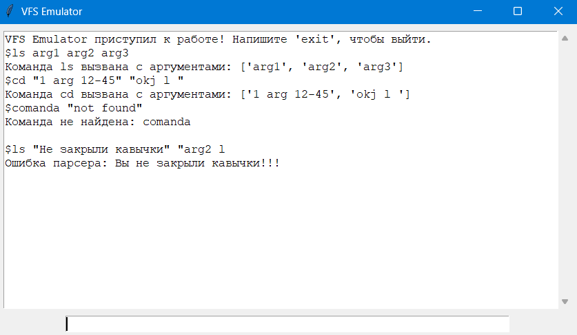

-------------------------------------------------------------------------

Этап 2:

Цель: сделать эмулятор настраиваемым, то есть поддержать ввод параметров
пользователя в приложение. Организовать для этого этапа отладочный вывод всех заданных параметров при запуске эмулятора.

1 требование: Параметры командной строки:
– Путь к физическому расположению VFS.
– Путь к стартовому скрипту.

Реализация:
self.VFSpath = VFSpath
self.StartupScript = StartupScript

2 требоване: Стартовый скрипт для выполнения команд эмулятора: выполняет команды последовательно, ошибочные строки пропускает. При выполнении скрипта на экране отображается как ввод, так и вывод, имитируя диалог с пользователем.

Реализация: 
Парсинг аргументов командной строки выполнен вручную в функции ManualParseArgs, которая извлекает --vfs и --script из sys.argv и передаёт их в конструктор VFSEmulator: 
def ManualParseArgs():
    VFSpath = None
    StartupScript = None
    argv = sys.argv[1:]
    i = 0
    while i < len(argv):
        if argv[i] == "--vfs" and i+1 < len(argv):
            VFSpath = argv[i+1]
            i += 2
        elif argv[i] == "--script" and i+1 < len(argv):
            StartupScript = argv[i+1]
            i += 2
        else:
            i += 1
    return VFSpath, StartupScript

if __name__ == "__main__":
    VFSpath, StartupScript = ManualParseArgs()
    RootWindow = tk.Tk()
    App = VFSEmulator(RootWindow, VFSpath=VFSpath, StartupScript=StartupScript)
    RootWindow.mainloop()

Метод RunStartupScript читает файл скрипта, формирует очередь строк StartupQueue, отключает ввод, если DisableInput=True, и последовательно вызывает ExecuteCommandString для каждой непустой и некомментированной строки.

def RunStartupScript(self, ScriptPath, DelayMs=50, UseComments=True, DisableInput=True):
    if not os.path.exists(ScriptPath):
        self.Print(f"Стартовый скрипт не найден: {ScriptPath}\n\n")
        self._startup_had_errors = True
        return
    with open(ScriptPath, 'r', encoding='utf-8') as f:
        RawLines = list(enumerate(f, start=1))

    self.StartupQueue = []
    for linenumber, rawline in RawLines:
        line = rawline.rstrip('\n').rstrip('\r')
        self.StartupQueue.append((linenumber, line))

    if DisableInput:
        try:
            self.InputEntry.configure(state='disabled')
        except Exception:
            pass

    self._running_startup = True
    self._startup_had_errors = False

    def ProcessNext():
        if not self.StartupQueue:
            if self._startup_had_errors:
                self.Print("Стартовый скрипт завершён с ошибками.\n\n")
            else:
                self.Print("Стартовый скрипт завершён.\n\n")
            self._running_startup = False
            if DisableInput:
                try:
                    self.InputEntry.configure(state='normal')
                except Exception:
                    pass
            return

        linenumber, line = self.StartupQueue.pop(0)
        stripped = line.strip()

        if not stripped:
            self.RootWindow.after(DelayMs, ProcessNext)
            return

        if UseComments and stripped.startswith('#'):
            self.RootWindow.after(DelayMs, ProcessNext)
            return

        try:
            self.ExecuteCommandString(stripped, EchoInput=True)
        except Exception as e:
            self.Print(f"Необработанная ошибка на строке {linenumber}: {e}\n")
            if getattr(self, "_running_startup", False):
                self._startup_had_errors = True

        self.RootWindow.after(DelayMs, ProcessNext)

    self.RootWindow.after(0, ProcessNext)

3 требование: Сообщить об ошибке во время исполнения стартового скрипта.
Реализация:
Во время выполнения стартового скрипта используется флаг self._running_startup. Если произошла ошибка парсера или была введена неизвестная команда, устанавливается self._startup_had_errors = True. В конце выводится: "Стартовый скрипт завершён." или "Стартовый скрипт завершён с ошибками."
В ExecuteCommandString при ошибках:

except ValueError as e:
    self.Print(f"Ошибка парсера: {e}\n\n")
    if getattr(self, "_running_startup", False):
        self._startup_had_errors = True
    return

При неизвестной команде:
else:
    self.Print(f"Команда не найдена: {cmd}\n\n")
    if getattr(self, "_running_startup", False):
        self._startup_had_errors = True

По окончании RunStartupScript:
if self._startup_had_errors:
    self.Print("Стартовый скрипт завершён с ошибками.\n\n")
else:
    self.Print("Стартовый скрипт завершён.\n\n")

В CMDexit:
def CMDexit(self, Args):
    if getattr(self, "_startup_had_errors", False):
        self.Print("Внимание: при выполнении стартового скрипта были ошибки.\n")
    self.Print("Команда exit вызвана. Приложение закрывается...\n")
    self.RootWindow.destroy()

4 Требование: Создать несколько скриптов реальной ОС, в которой выполняется эмулятор. Включить в каждый скрипт вызовы эмулятора для тестирования всех поддерживаемых параметров командной строки.

Реализация:
Файл script_1.txt:
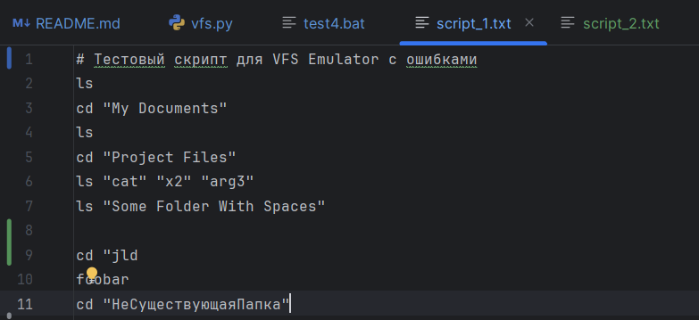

Файл script_2.txt:
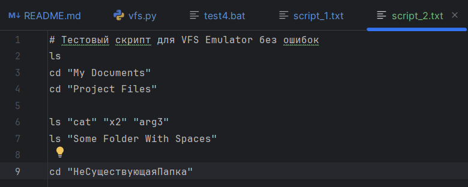

Файл VFS.csv пока что можно оставить пустым, так как он не задействован в программе.

Файл test1.bat:
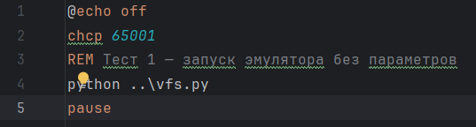
Результат выполнения:
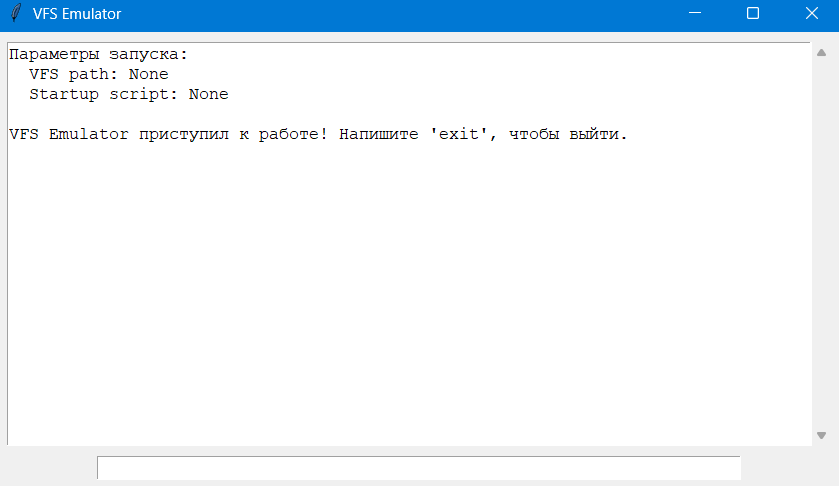

Файл test2.bat:
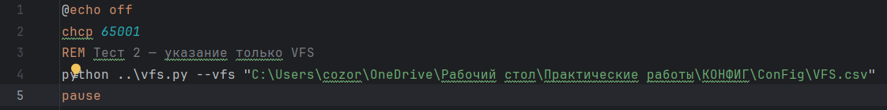
Результат выполнения:
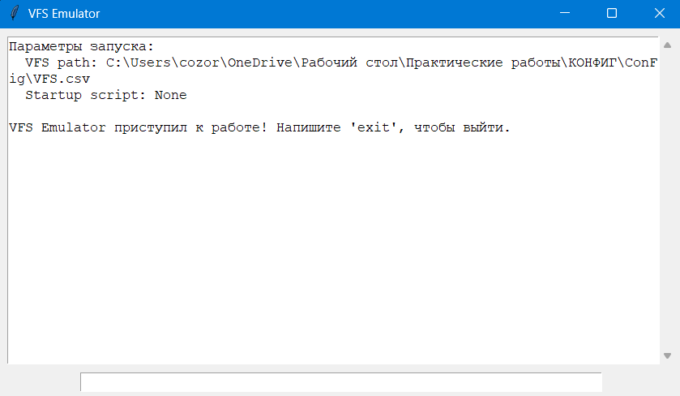

Файл test3.bat:
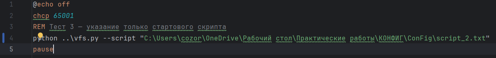
Результат выполнения:
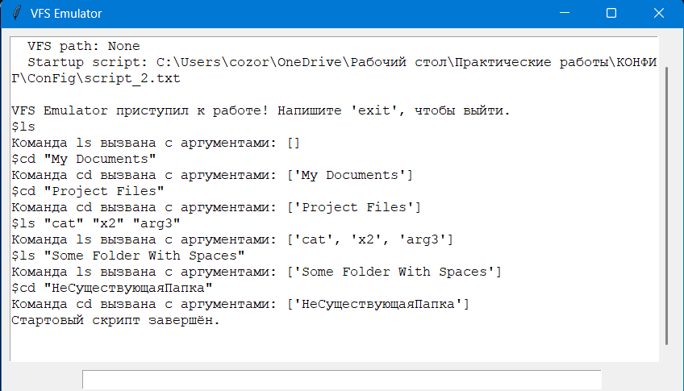

Файл test4.bat:
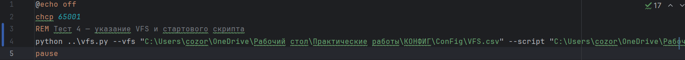
Результат выполнения:
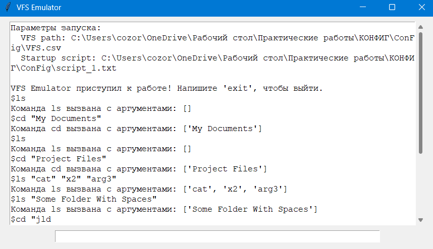
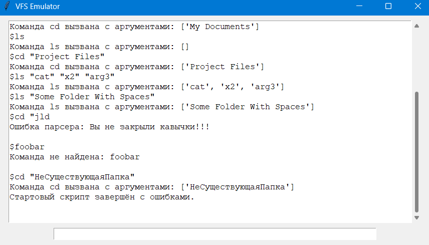

------------------------------------------------------------------------

Этап 3. VFS
Цель: подключить виртуальную файловую систему (VFS).
1 Требование: Все операции должны производиться в памяти. Запрещается распаковыватьили иным образом модифицировать данные VFS, за исключением возможных служебных команд.
Реализация: Виртуальная файловая система полностью создана в оперативной памяти с помощью класса VFSNode. С помощью него создаются узлы, каждый из которых имеет имя, тип, бинарное содержимое для файлов и словарь детей для директорий. Все методы изменяют только объекты в памяти.

class VFSNode:
    def __init__(self, Name, NodeType="directory", Content=None, Parent=None):
        self.Name = Name
        self.Type = NodeType
        self.Content = Content if Content else b""
        self.Children = {}
        self.Parent = Parent

    def AddChildren(self, Child):
        if self.Type != "directory":
            raise ValueError("Нельзя добавлять потомка в файл")
        self.Children[Child.Name] = Child
        Child.Parent = self

    def GetChild(self, Name):
        return self.Children.get(Name)

    def ListChildren(self):
        return list(self.Children.values())

    def Path(self):
        parts = []
        node = self
        while node is not None and node.Parent is not None:
            parts.append(node.Name)
            node = node.Parent
        return "/" + "/".join(reversed(parts))

2 Требование: Источником VFS является CSV-файл. Для двоичных данных используется base64 или аналогичный формат. Необходимо разобраться, как представлять вложенные элементы VFS.

Реализация: Загрузка VFS из CSV выполняется методом LoadVFSMenual, который читает файл через csv.DictReader, разбивает путь на части и строит дерево в памяти. Для файлов содержимое в base64 и декодируется в байты, для директорий создаются соответствующие узлы. Родительские связи строятся по частям пути и сохраняются в словаре nodes для поиска родителя.

    def LoadVFSManual(self, CSVPath):
        if not os.path.exists(CSVPath):
            self.Print(f"Файл VFS не найден: {CSVPath}\n")
            self.VFSRoot = None
            self.CurrentDir = None
            self._startup_had_errors = True
            return

        root = VFSNode("/", "directory")
        nodes = {"/": root}

        errors = []
        processed_paths = set()

        try:
            with open(CSVPath, "r", encoding="utf-8-sig", newline='') as csvfile:
                reader = csv.DictReader(csvfile)
                if reader.fieldnames is None:
                    self.Print(f"Ошибка формата VFS: CSV не содержит заголовков.\n")
                    self.VFSRoot = None
                    self.CurrentDir = None
                    self._startup_had_errors = True
                    return

                fnames = [fn.strip() for fn in reader.fieldnames]
                if "Path" not in fnames or "Type" not in fnames:
                    self.Print(
                        f"Ошибка формата VFS: в CSV обязателен столбец 'Path' и 'Type'. Найдены: {', '.join(fnames)}\n")
                    self.VFSRoot = None
                    self.CurrentDir = None
                    self._startup_had_errors = True
                    return

                raw_rows = list(enumerate(reader, start=2))  # start=2 — потому что header на 1 строке
                for lineno, row in raw_rows:
                    raw_path = row.get("Path")
                    raw_type = row.get("Type")
                    raw_content = row.get("Content", "")

                    if raw_path is None or raw_type is None:
                        errors.append((lineno, "Отсутствует обязательное поле 'Path' или 'Type'"))
                        continue

                    path = raw_path.replace("\\", "/").strip()
                    type_ = raw_type.strip()
                    content = raw_content.strip() if raw_content else ""

                    if not path:
                        errors.append((lineno, "Пустое значение Path"))
                        continue

                    if path == "/":
                        continue

                    stripped_path = path.strip("/")
                    path_parts = [p.strip() for p in stripped_path.split("/") if p.strip() != ""]
                    if not path_parts:
                        errors.append((lineno, f"Некорректный Path: '{raw_path}'"))
                        continue

                    node_name = path_parts[-1]
                    parent_path = "/" + "/".join(path_parts[:-1]) if len(path_parts) > 1 else "/"

                    parent = nodes.get(parent_path)
                    if not parent:
                        errors.append((lineno, f"Родительский путь не найден: '{parent_path}' для '{path}'"))
                        continue

                    if type_ == "file":
                        try:
                            content_bytes = base64.b64decode(content) if content else b""
                        except Exception:
                            content_bytes = b""
                            errors.append(
                                (lineno, f"Невалидный base64 в Content для файла '{path}' — содержимое будет пустым"))
                        node = VFSNode(node_name, "file", content_bytes, Parent=parent)
                    elif type_ == "directory":
                        node = VFSNode(node_name, "directory", None, Parent=parent)
                    else:
                        errors.append((lineno, f"Неизвестный Type '{type_}' в строке"))
                        continue

                    if node_name in parent.Children:
                        errors.append(
                            (lineno, f"Дубликат узла '{node_name}' в '{parent_path}' — строка проигнорирована"))
                        continue

                    parent.AddChildren(node)
                    processed_paths.add(path)

                    if type_ == "directory":
                        full_path = parent_path + "/" + node_name if parent_path != "/" else "/" + node_name
                        nodes[full_path] = node

            if errors:
                self.Print(f"В процессе загрузки VFS обнаружены ошибки в файле {CSVPath}:\n")
                for lineno, msg in errors:
                    self.Print(f"  строка {lineno}: {msg}\n")
                self.Print("\nVFS не загружена из-за ошибок формата.\n")
                self.VFSRoot = None
                self.CurrentDir = None
                self._startup_had_errors = True
                return

            # Успешно загружено (и ошибок не найдено)
            self.VFSRoot = root
            self.CurrentDir = root
            self.Print(f"VFS загружена успешно: {CSVPath}\n")

        except Exception as e:
            self.Print(f"Ошибка при загрузке VFS: {e}\n")
            self.VFSRoot = None
            self.CurrentDir = None
            self._startup_had_errors = True

3 Требование: Сообщить об ошибке загрузки VFS (файл не найден, неверный формат).

Реализация: Метод LoadVFSManual проверяет наличие файла, корректность заголовков CSV, накапливает ошибки при разборе строк. При наличии ошибок выводит подробный список с номерами строк и прекращает загрузку, устанавливая флаг _startup_had_errors. Код выше.

4 требование: Создать несколько скриптов реальной ОС, в которой выполняется эмулятор. Включить в каждый скрипт вызовы эмулятора для тестирования работы c различными вариантами VFS (минимальный, несколько файлов, не менее 3 уровней файлов и папок).

Реализация: Были созданы файлы следующие файлы:
basic_vfs.csv
Содержимое:
Path,Type,Content
/,directory,
/file1.txt,file,SGVsbG8gZnJvbSBmaWxlMQo=
/dir1,directory,
/dir1/file2.txt,file,RmlsZTIgY29udGVudAo=

test_vfs_basic.bat
Содержимое:
@echo off
chcp 65001
REM Тест - базовый
python ..\vfs.py --vfs "C:\Users\cozor\OneDrive\Рабочий стол\Практические работы\КОНФИГ\ConFig\CSV_files\basic_vfs.csv" --script "C:\Users\cozor\OneDrive\Рабочий стол\Практические работы\КОНФИГ\ConFig\script_files\basic_test.txt"

basic_test.txt
Содержимое:
ls
ls /
ls "dir1"
ls /dir1
cd dir1
ls
cd ..
ls file1.txt
cd nonexist
ls "unclosed quote

multiple_files_vfs.csv
Содержимое:
Path,Type,Content
/,directory,
/rootfile.txt,file,Um9vdCBmaWxlCg==
/docs,directory,
/docs/readme.txt,file,QW5vdGhlciBmaWxlCg==
/bin,directory,
/bin/tool.sh,file,RW1wdHkgc2NyaXB0Cg==
/bin/empty_dir,directory,

test_vsf_multiple_files.bat
Содержимое:
@echo off
chcp 65001
REM Тест с несколькими файлами
python ..\vfs.py --vfs "C:\Users\cozor\OneDrive\Рабочий стол\Практические работы\КОНФИГ\ConFig\CSV_files\multiple_files_vfs.csv" --script "C:\Users\cozor\OneDrive\Рабочий стол\Практические работы\КОНФИГ\ConFig\script_files\multiple_files_test.txt"

multiple_files_test.txt
Содержимое:
ls "dir with spaces"
ls "dir with \"escaped\" quotes"
ls "unclosed
# Проверка простых команд
ls
cd /
ls file1.txt
cd dir1
ls
cd ..
cd nonexist
# Проверка относительных переходов
cd /
cd dir1
cd ..
cd .
cd ..
# Ошибочные команды
foobar

deep_structure_vfs.csv
Содержимое:
Path,Type,Content
/,directory
/a,directory,
/a/file_a.txt,file,TGV2ZWwxCkxldmVsMgpMZXZlbDMK
/a/b,directory,
/a/b/b_file.txt,file,RGVlcCBmaWxlCg==
/a/b/c,directory
/a/b/c/deep.txt,file,RGVlcCBmaWxlCg==
/x,directory
/x/y,directory
/x/y/z,directory
/x/y/z/zfile.txt,file,Um9vdCB6IGZpbGUK

test_vfs_deep_structure.bat
Содержимое:
@echo off
chcp 65001
REM Тест с глубокой структурой
python ..\vfs.py --vfs "C:\Users\cozor\OneDrive\Рабочий стол\Практические работы\КОНФИГ\ConFig\CSV_files\deep_structure_vfs.csv" --script "C:\Users\cozor\OneDrive\Рабочий стол\Практические работы\КОНФИГ\ConFig\script_files\deep_structure_test.txt"
pause

deep_structure_test.txt
Содержимое:
ls /
cd /a
ls
cd b
ls
cd c
ls
cd ..
cd ..
cd ..
ls /x/y/z
cd /x/y/z
ls
cat deep.txt

С помощью файла test_comprehensive.bat происходит запуск трёх предыдущих тестов.
Содержимое:
@echo off
chcp 65001

call test_vfs_basic.bat
call test_vfs_multiple_files.bat
call test_vfs_deep_structure.bat

pause

Результат запуска файла test_comprehensive.bat: Будет создано 3 окна VFS Emulator, которые будут выполнять друг за другом команды из basic_test.txt, multiple_files_test.txt, deep_structure_test.txt:

1 окно:
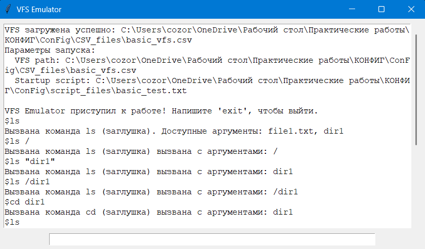
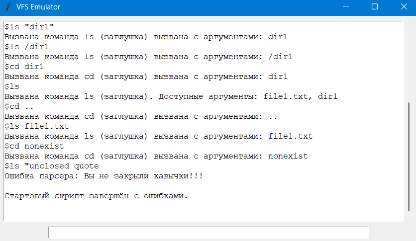

2 окно:
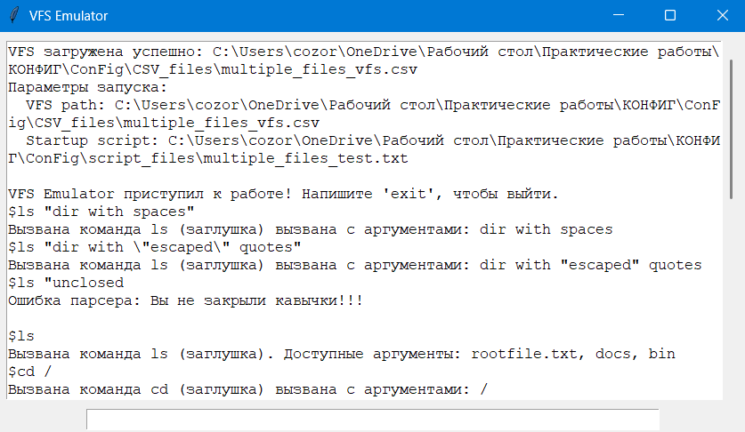

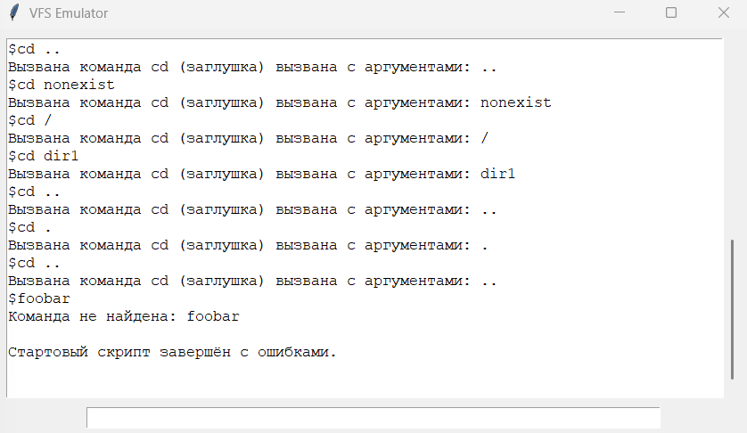

3 окно:
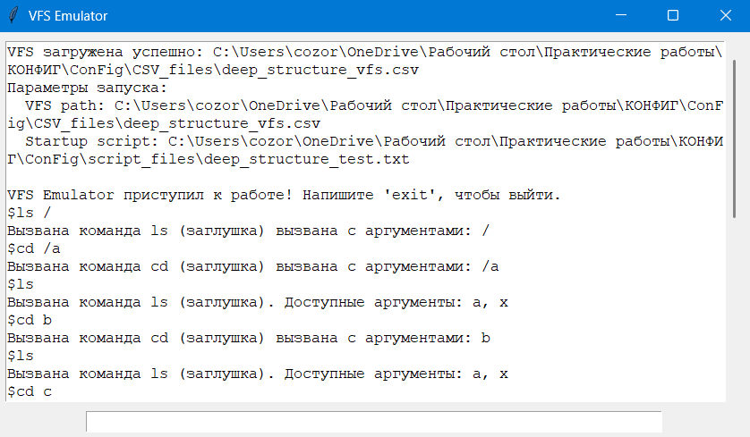
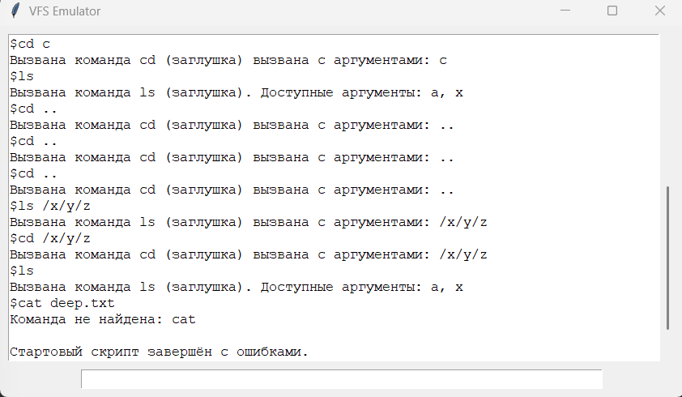

Также файл test3.bat показывает, что, если путь VFS указан неправильно, то выведется сообщение об ошибке и программа работать не будет.
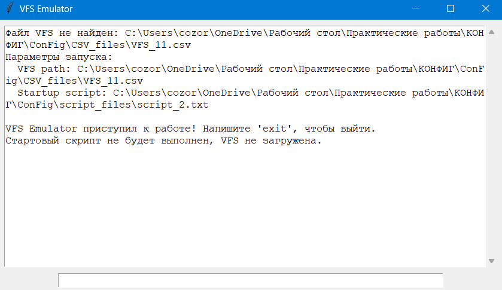

Файл test2.bat показывает, что будет, если не загрузить VFS:
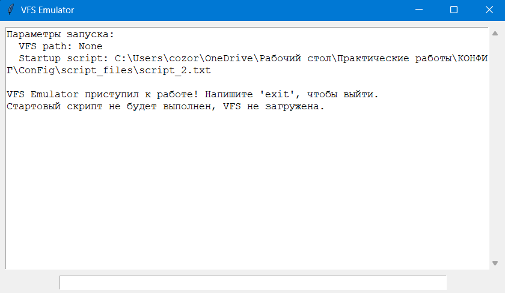

Файл test4.bat показывает, что будет, если загрузить VFS, содержащую ошибку:
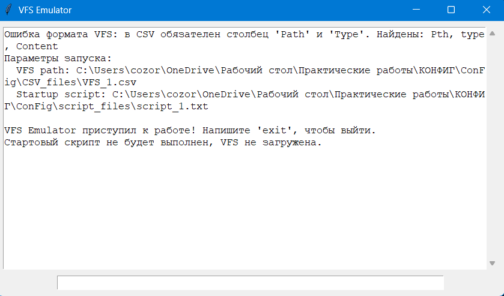